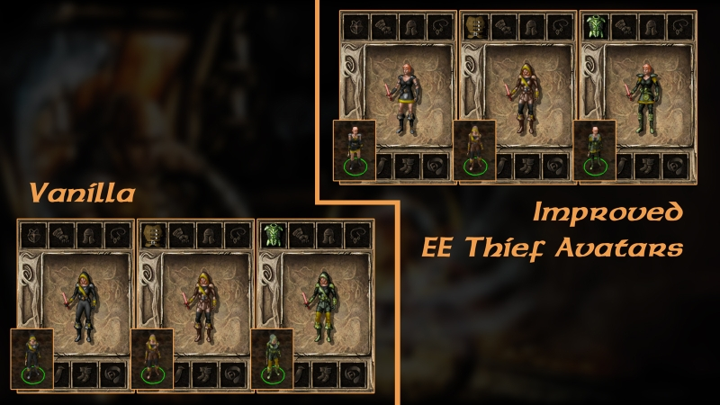

# A Moment With Imoen

Romance mod for Imoen - Full romance arc, many new banters, and interjections.

# Introduction

A Moment With Imoen is a romance mod for Imoen in Baldur's Gate 2.

Features:
- Full romance arc with a human male PC
- Numerous new banters with every Bioware NPC
- A full array of interjections

# Installation

To Install: Unpack the archive into your BG2 directory and run Setup-AMWImoen.exe.

Mod Components:
1. A Moment With Imoen - Base mod.
2. Improved EE Thief Avatars (EE Only) - Allows unarmored and chainmail to change appearance for thief avatars. See screenshot for before and after.
3. Classic BG2 Imoen Colors (EE Only) - Restores Imoen's colors from original Baldur's Gate 2.
4. Romance Cheat: No Race Restrictions - Removes race restrictions in Imoen's romance.

Install both Improved Avatars and Classic Colors if you're using EE and want Imoen to look exactly like she did in the original BG2. Personally, Imoen without her little skirt and hooded Aran Linvail will never not bother the hell out of me.

# Compatibility

The mod is fully tested for Baldur's Gate 2 EE. It installs fine for the original BG2 and should work, but I've never tested it in depth, so I don't know for sure.

# Frequently Asked Questions

**Q: "Is the romance incestuous?"**
- No. Imoen and PC have no familial relations whatsoever. Their shared Bhaalspawn heritage is treated strictly as a spiritual bond by the game world.

**Q: "Didn't Imoen and PC grow up together like family?"**
- No. They didn't meet until they were 10 to 11 years old, well past the family bonding age window. Moreover, they were very much living apart in Candlekeep.

**Q: "What is the content rating?"**
- PG-13. Overall, the content probably sits somewhere between Aerie and Viconia.

**Q: "Is there any questionable content regarding Imoen's early years?"**
- No. Imoen and PC's early years are treated with utmost respect, if mentioned at all.

**Q: "Who will Imoen romance?"**
- Human male PC only. Optional cheat to remove this restriction is included, but it's highly recommended to just play as human.

**Q: "Do I have to play around romance timers?"**
- No. There is not a single romance timer. Everything relies on scripted triggers. The mod is written to be as unintrusive to the gameplay as possible.

**Q: "Should I rescue Imoen as soon as possible or take my time in Chapter 2?"**
- It is highly recommended to rescue Imoen as soon as possible.

**Q: "What happens if I don't romance Imoen?"**
- There are non-romance related interjections and banters, but you will miss out on most of the content. For example, there are 7 banters with Jaheira, and it drops to 0 if Imoen isn't romanced.

**Q: "Should I play the game a certain way to get the most content?"**
- Yes. Try not to skip content and follow the intended path: Spellhold -> City-of-Caverns -> Ust Natha. Explore and talk to everyone. Stuff like that.

**Q: "Who should I take in my party to get the most content?"**
- The mod adds well over 80 banters for all Bioware NPCs, so pretty much anybody works. See the Banter List section if you have trouble deciding who to go with.

**Q: "Does the mod add any content to Chapter 2/3 prior to rescuing Imoen?"**
- Mostly no. The base game already has enough good well-written content for her in those early chapters. Though, this is another reason to get her early.

**Q: "Does the mod use descriptive parentheticals?"**
- They are only used a few times when it's absolutely necessary, as per the vanilla game.

**Q: "Does the mod include any content for EE NPCs?"**
- No. [Convenient Enhanced Edition NPCs](https://github.com/Argent77/A7-NoEENPCs) is great if you're looking for a way to get rid of them altogether.

**Q: "Does the mod play off of the events in Siege of Dragonspear?"**
- No. The mod does not recognize any of the material written by Beamdog. It only recognizes the story in the original BG1 and BG2.

**Q: "What music does the mod use?"**
- The mod uses only vanilla music tracks. Imoen's romance theme is Melissan's Theme from TOB.

**Q: "Why is there no music in the romance talks?"**
- Having the theme pop up on every dialogue is simply annoying. Plus it telegraphs that "duh duh duh, a romance talk is happening right now!" Instead of letting it speak for itself. Just keep playing, you'll hear some music eventually.

**Q: "Does Imoen conflict with any NPC?"**
- She gets along just fine with everybody.

**Q: "Can I skip the Irenicus dungeon?"**
- Yes. The mod can be installed mid-game with no issues as well. However, it's not recommended to do this once you've progressed further than the Chapter 2 auto-save, because the mod has to keep track of a few things. If you do install it mid-game, then take a trip to Waukeen's Promenade afterwards and stand there for a few seconds to let the script initialize.

# Banter List

| Banters | 85 Total (+ TOB) |
| ------------- | ------------- |
| Aerie | 5 |
| Anomen | 2 (5 if LG, 5 if CN) |
| Cernd | 5 |
| Edwin | 6 |
| Haer'Dalis | 6 + 1 |
| Jaheira | 7 |
| Jan | 5 |
| Keldorn | 6 + 1 |
| Korgan | 5 |
| Mazzy | 4 |
| Minsc | 7 |
| Nalia | 4 |
| Sarevok | 0 + 1 |
| Valygar | 7 |
| Viconia | 5 + 1 |
| Yoshimo | 1 (PC Only) |

The mod uses a custom trigger system for banters. Most of the banters are in Chapter 6, with some being location based. Everything is paced evenly throughout, so you don't ever have to sit idle to wait for the banters to come up.

If you feel like you're rushing through the game too fast and outpacing the banters, you can always just go somewhere like Umar Hills and rest repeatedly to exhaust the banters. This is most likely not needed if you are playing normally.

# Gameplay Information

### **General Gameplay Tips**
   
1. It's highly recommended to rescue Imoen as quickly as possible.
    - Simply put, the more you do in Chapter 2/3, the less Imoen content you'll see. There are romance dialogues attached to all the major side quests and a few minor quests, none of which are retroactive. The mod also adds a good amount of interjections, as early as the Circus Tent, Amalas in Copper Coronet, etc. Plus, most of the new banters occur in Chapter 6, so you want the breathing room. Ideally, you want to quickly assemble your party and set sail as soon as possible.

3. It's highly recommended to follow the intended game path: Spellhold -> City-of-Caverns -> Ust Natha.
    - Again, you've got to play the content to see the content. Also recommended to play the good path. Evil content in the base game is mostly lame and an afterthought.

5. It's highly recommended to raise dead party members as soon as possible, especially Imoen.
    - The mod relies on scripted triggers. Running around with dead party members is a very good way to skip trigger points and break intended behavior. Note that the romance will not end if Imoen gets disabled by spells that remove her from the party. You can just hire her back in and keep going.

### **Starting The Romance**

Short answer: Be a human male and don't romance other NPCs.

Long answer:

1. You need to be a human male.

2. Don't sisterzone Imoen in any dialogue with the other NPCs prior to Chapter 4. Like referring to her as "like your sister".

3. Don't progress the other romances past a certain point. Going past these talks will shut off Imoen's romance even if you shut those romances down after the fact. Those romance talks are the following:
    - Aerie: Romance talk #7 - ("Have you traveled much? I have been over much of Amn and Tethyr with the circus...")
    - Jaheira: Romance talk #14 - ("So, what do you think of Amn so far?...")
    - Viconia: Romance talk #10 - ("Tell me... has there ever been anyone special to you?...")

4. Don't have an ongoing romance with another NPC when you rescue Imoen. The cutoff point is when you enter Spellhold and recruit Imoen.

 - The mod adds additional dialogue options to some vanilla romance talks, so PC can reject the ladies earnestly without being an total jerk or going out of character. You can do this as early as romance talk #1 with Aerie/Viconia and #2 with Jaheira.

### **Playing The Romance**

The mod runs entirely on scripted triggers. There is not a single romance timer. So feel free to play at your own pace. Do make an effort to rest for the dreams and sleep triggers if you're really blazing through the game.

Besides that, just enjoy the ride. You are not walking on eggshells in this romance.

# Copyright

© 2026 Wombat – All Rights Reserved

